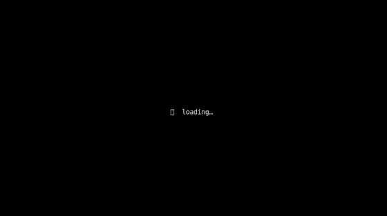
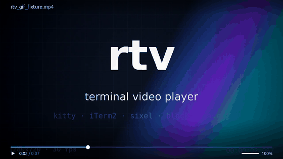

# rtv

*Léelo en [español](README_ES.md).*

A terminal video player written in Rust. Genuinely fast: it starts in tens
of milliseconds, keeps audio and video in sync the way a serious player does
(audio master clock, ffplay-style), and exploits your terminal's graphics
protocol to squeeze out the highest resolution it can offer.

```
rtv movie.mkv
```

That's it. It detects the terminal, picks the best rendering backend, sends
audio to the default device, and plays.

## Demos

One clip per rendering backend, captured from rtv's real terminal
output (scripts/capture_demo_gifs.py decodes the exact escape stream
the player emits — kitty graphics, iTerm2 inline images, sixel, and
the text backends rasterized through a terminal emulator).

| Backend | Demo |
|---|---|
| `kitty` (pixel-perfect) |  |
| `iterm2` (inline images) |  |
| `sixel` (DEC graphics) |  |
| `blocks` (half-block cells) |  |
| `ascii` (plain text) |  |
| GUI window (`--gui`, egui/wgpu) — hover time tooltip, Space pauses |  |

## Why it exists

`mpv --vo=tct` works, but it drags the whole of mpv along just to paint
colored cells, and `--vo=kitty` leaves fine-grained pacing to a render path
that was never designed for terminals. rtv attacks the problem from the
other side: a ~1 MB binary that only knows how to do one thing — decode
with FFmpeg and paint into a terminal — and does it with the lowest latency
and the fewest bytes per frame we could manage.

The comparison below was verified against mpv's actual source code
(`vo_tct.c`, `vo_kitty.c`, `vo_sixel.c`, `terminal-unix.c`), not folklore:

| | `mpv --vo=tct` / `--vo=kitty` | rtv |
|---|---|---|
| Startup | ~150–300 ms | ~20–40 ms |
| Half-block cells | SGR fg+bg emitted for every cell, every frame | delta-encoded (~30–50 % fewer bytes) |
| Kitty graphics transfer | shm locally; plain base64 over ssh (no compression) | shm locally; **zlib `o=z`** over ssh (~10× less traffic than raw base64) |
| Kitty protocol overhead | `q=2`, `m=1` chunking (same as rtv) | `q=2`, `m=1` chunking |
| Cell-size detection | `ioctl(TIOCGWINSZ)` only — no pixel info over ssh | `ioctl` + CSI `16t`/`14t` probe — full resolution over ssh too |
| Sixel dithering | libsixel, dynamic per-frame histogram palette | fixed 6×7×6 palette + ordered Bayer (cheaper per frame) |
| Stripped binary | ~40 MB | ~1.1 MB (dynamic FFmpeg) |
| Master clock | audio (libmpv) | audio (cpal), or monotonic without audio |
| Render resolution | fixed per vo | adaptive to the real cell size |

Measured with the binaries in this repo; exact numbers depend on the
machine and the terminal, but the orders of magnitude hold. Where mpv is
better we say so: its sixel path adapts the palette per frame, which can
look better on some content at a higher CPU cost.

## Features

- **Any format FFmpeg swallows** (via `ffmpeg-the-third`, tested against
  FFmpeg 7.1): H.264, HEVC, AV1, VP9… Video decode uses frame threading
  across all cores.
- **Real audio** with `cpal`: WASAPI on Windows, ALSA/PulseAudio on Linux,
  CoreAudio on macOS. Any source layout/format is converted to stereo f32
  at the device's native sample rate with `libswresample`.
- **ffplay-style A/V sync**: the audio clock (the sink's real playback
  position, with output latency compensated and smoothed) drives the video.
  `compute_target_delay` with the same thresholds as ffplay. In practice:
  median avdiff of 0–2 ms in steady state, even with software 4K AV1 on
  2 cores.
- **Instant, mpv-style seeks**: `←`/`→` land on the keyframe ≤ target and
  the audio jumps to the video's exact landing PTS. No silently decoding
  whole GOPs, no desync after seek bursts.
- **Adaptive scaling from the real cell size**: at startup the terminal is
  probed (CSI `16t`/`14t` on kitty, WezTerm, Ghostty, iTerm2, foot,
  Konsole, xterm) to learn each cell's pixel size and scale the video to
  the maximum resolution the window can display. Bigger window, sharper
  picture — including over ssh, where mpv's ioctl-only detection gets no
  pixel information at all.
- **Instant live resize**: the redraw after a resize takes ~1 ms
  (event-interruptible inter-frame wait + immediate rescale of the frame
  on screen), and the decoder retargets `sws_scale` without draining its
  pre-decode cushion or losing sync.
- **Five rendering backends** with auto-detection: Kitty graphics protocol
  (real pixels, zlib-compressed; Kitty/Ghostty/WezTerm), **iTerm2 inline
  images** (OSC 1337, in-memory BMP — also over ssh via `LC_TERMINAL`),
  real **Sixel** (fixed 6×7×6 palette + ordered Bayer dithering + RLE;
  mlterm/foot/contour/xterm `-ti vt340`), truecolor half-blocks (`▀`, 2 px
  per cell) and ASCII.
- **A windowed GUI too**: `rtv --gui video.mp4` opens a native window
  (winit + wgpu + egui) with the same playback core as the terminal —
  same clocks, same sync engine, same seek protocol — plus an on-screen
  HUD with a clickable/scrubbable progress bar, hover timestamps,
  fullscreen, and auto-hiding controls.
- **Opt-in softsubs**: no subtitles are shown by default. `--sub` (no
  value) uses the container's embedded text track (MKV/MP4); `--sub
  file.srt` (or `.ass`) loads an external file. Text is drawn centered,
  bold, bright white, right below the image (if letterboxed) or in the
  2 rows reserved above the HUD, without touching the video pipeline: the
  embedded track is loaded in a separate subtitle-only demux thread
  (`AVDISCARD_ALL` on every other stream) and time lookup is a binary
  search per frame. ASS `{\...}` tags and SRT HTML are stripped.
- **Discreet HUD**: progress bar, time and volume in 1–2 lines (with
  `--stats` it adds backend, resolution, cell size, fps and drops) that
  adapt to the width. It only repaints when something changes (no flicker)
  and hides itself when the window is too small to be readable.
- **The terminal is always left clean**: alt-screen, autowrap disabled
  during playback, and full restoration on exit — also on `Ctrl+C` or with
  audio still playing. libav logs (`libdav1d`, `libaom`…) are silenced so
  no `error parsing obu data` ever smears the TUI.

## Installation

### Prebuilt binaries (recommended)

Every [release](../../releases) ships **self-contained** packages for
Windows (x86_64), Linux (x86_64/arm64), macOS (Intel/Apple Silicon) and
**Termux/Android (aarch64/x86_64)** with **FFmpeg 7.1 bundled inside** —
no need to install FFmpeg or anything else:

```bash
tar -xzf rtv-*-linux-x86_64.tar.gz && cd rtv-*/ && ./rtv video.mp4
```

On Windows: unzip the `.zip` and run `rtv.exe video.mp4` (the FFmpeg DLLs
sit next to the exe). On Termux: unpack `rtv-*-termux-aarch64.tar.gz` in
your Termux `$HOME` and run the bundled `rtv` launcher (it comes with the
full library closure — FFmpeg, dav1d, gnutls — validated in CI against a
clean Termux container; audio needs `pkg install pulseaudio` +
`pulseaudio --start`). The binary must stay next to its `lib/`/`libs/`
folder (Linux/macOS/Termux) or next to the DLLs (Windows). Packages are
built in CI ([`.github/workflows/build.yml`](.github/workflows/build.yml));
the workflow is triggered manually (Actions → build → *Run workflow*) or
by pushing a `v*` tag. You can also grab the artifacts of any workflow run.

### Building from source

You need Rust (edition 2021) and the FFmpeg development libraries.

#### Linux (Debian/Ubuntu)

```bash
sudo apt install libavformat-dev libavcodec-dev libavutil-dev \
                 libswscale-dev libswresample-dev libclang-dev \
                 libasound2-dev pkg-config
cargo build --release
```

#### macOS

```bash
# NOTE: ffmpeg@7, not ffmpeg — brew now ships FFmpeg 8.x, which does NOT
# build with ffmpeg-the-third 5.0 (same reason as in BUILD-WINDOWS.md).
brew install ffmpeg@7 pkg-config
export FFMPEG_DIR="$(brew --prefix ffmpeg@7)"   # ffmpeg@7 is keg-only
cargo build --release
```

#### Windows

Full guide in [`BUILD-WINDOWS.md`](BUILD-WINDOWS.md). In short:

1. Download `ffmpeg-n7.1-latest-win64-lgpl-shared.zip` from
   [BtbN/FFmpeg-Builds](https://github.com/BtbN/FFmpeg-Builds/releases).
2. Unzip to `C:\ffmpeg\` (you should end up with `include`, `lib`, `bin`).
3. `$env:FFMPEG_DIR = "C:\ffmpeg"` and add `C:\ffmpeg\bin` to `PATH`.
4. `cargo clean && cargo build --release`.

Run rtv from **Windows Terminal** (or another modern terminal): it
supports truecolor, half-blocks, Sixel (≥ 1.22) and WASAPI out of the box.
Avoid the legacy `cmd.exe` console host — it cannot display non-ASCII
output correctly, which rules out every backend except `ascii`.

#### Termux (Android)

rtv runs natively on Termux (no proot, no containers). The script
[`scripts/build-termux.sh`](scripts/build-termux.sh) does everything:

```bash
pkg install -y git
git clone https://github.com/correo415415/rtv.git && cd rtv
bash scripts/build-termux.sh
rtv video.mp4
```

What the script takes care of:

- **FFmpeg**: Termux repos already ship FFmpeg 8.x, which does **not**
  build with `ffmpeg-the-third 5.0`. The script builds FFmpeg **7.1.5**
  from source (decode-only, with dav1d) into `~/rtv-ffmpeg` — slow the
  first time, cached for every build after that.
- **Audio**: cpal (AAudio/oboe) does not work in Termux console
  processes, so on Termux rtv uses its own **PulseAudio** backend (loads
  `libpulse-simple` at runtime, no build dependency). To get sound:

  ```bash
  pkg install -y pulseaudio
  pulseaudio --start
  ```

  Without a PulseAudio server the video still plays, just silent (same
  behavior as `--no-audio`).
- **Install**: drops an `rtv` wrapper into `$PREFIX/bin` that exports the
  `LD_LIBRARY_PATH` of the compiled FFmpeg.

The recommended terminal backend on Termux is whatever rtv auto-detects
(`blocks`/truecolor); with a touch keyboard, the HUD's mouse controls
(tap on the progress bar) work if the terminal reports mouse events.

All of this is validated in CI without a physical device inside the
[`build.yml`](.github/workflows/build.yml) workflow (`termux-*` jobs),
which builds and tests rtv (including the real PulseAudio audio path)
inside [`termux/termux-docker`](https://github.com/termux/termux-docker)
images for x86_64 and aarch64, and publishes `rtv-*-termux-*` packages as
artifacts (and in releases, next to the other platforms).

## Usage

```
rtv <file|URL> [options]
```

The input can be a local file, a **direct http/https URL** (mp4, mkv, HLS
`.m3u8`… — network protocols are built into the bundled FFmpeg, TLS
included) or the **page of a video site** (YouTube, Twitch, Vimeo,
Dailymotion) if you have [yt-dlp](https://github.com/yt-dlp/yt-dlp)
installed:

```bash
rtv https://example.com/video.mp4                # direct URL
rtv https://www.youtube.com/watch?v=aqz-KE-bpKQ  # via yt-dlp
rtv --ytdl https://any-site-yt-dlp-supports/…
```

**The Linux/Windows/macOS release packages already include yt-dlp** (the
official standalone, next to the rtv binary): it works right after
unpacking. rtv looks in this order: `$RTV_YTDLP` → `yt-dlp` on `PATH` (if
you installed one with pip/winget/brew it wins, since it's easier to keep
updated) → the bundled one. The bundled one self-updates with `yt-dlp -U`.
On Termux there is no yt-dlp Android build:
`pkg install python-pip && pip install yt-dlp`.

With YouTube, the default requests **video up to 1080p + audio as
separate DASH streams** (dual input: two connections, one per demuxer,
audio as master clock) with a fallback to muxed. `--ytdl-format b` forces
a single connection. You can also wire up the dual input yourself:

```bash
rtv movie.mkv --audio-file directors_commentary.m4a
```

| Option | Effect |
|---|---|
| `--gui` | Open in a native window (winit + wgpu + egui) instead of the terminal — same playback engine, on-screen HUD with clickable progress bar and fullscreen |
| `--info` | Does NOT play: prints the file's information — name, size, date, format, duration, bitrate, metadata, video track (codec, resolution + `1080p/4K…` label, fps), every audio track (codec, channels, Hz, language) and subtitle track (language, text/bitmap), and chapters. Pipeable output (no ANSI if stdout is not a terminal) |
| `--backend <kitty\|iterm2\|sixel\|blocks\|ascii>` | Force a backend (auto-detected by default) |
| `--scale <0.1..1.0>` | Cap the render resolution. Useful on 4K terminals where software decode can't keep up |
| `--loop-video` | Restart when the end is reached |
| `--stats` | Telemetry in the HUD: backend, resolution, cell size, shown/decoded FPS and drops (without the flag the HUD stays clean: transport + volume) |
| `--no-audio` | No audio; video runs on a monotonic clock |
| `--audio-backend <auto\|cpal\|pulse\|none>` | Audio output backend. `auto` (default) uses cpal (ALSA/WASAPI/CoreAudio) and on Termux tries PulseAudio first; `pulse` forces PulseAudio (via `libpulse-simple`, loaded at runtime); `none` equals `--no-audio`. A forced backend that fails to start ⇒ video without audio (no silent fallback) |
| `--sub [file.srt\|.ass]` | Enable subtitles: with no value uses the container's embedded text track; with a file loads external subtitles. Without `--sub` no subtitles are shown |
| `--no-subs` | Disable subtitles even if `--sub` is passed (compatibility) |
| `--aid <N>` / `--alang <language>` | Initial audio track: by 1-based index among the audio tracks (`--aid 2` = second) or by language (`--alang spa`), mpv-style. No match → FFmpeg's "best" track |
| `--sid <N>` / `--slang <language>` | Initial embedded subtitle track (by text-track index / by language). Implies subtitles ON even without `--sub` |
| `--hwdec <auto\|none\|vaapi\|cuda\|qsv\|d3d11va\|dxva2\|videotoolbox\|vulkan\|drm\|vdpau>` | Hardware decode. `auto` (default) tries the platform's hwaccels and falls back to software if none works; `none` forces software |
| `--ytdl` | Force resolution through yt-dlp for ANY URL (the big sites — YouTube, Twitch, Vimeo, Dailymotion — are detected automatically, no flag needed) |
| `--ytdl-format <FMT>` | Format requested from yt-dlp (its `-f` syntax). Default `bv*[height<=?1080]+ba/b`: best video ≤1080p + best audio as separate streams (dual input), with fallback to muxed. `b` forces muxed (a single connection) |
| `--audio-file <file\|URL>` | Play the AUDIO from another file/URL (dual input), like mpv's `--audio-file`. Takes priority over yt-dlp's separate audio |
| `--verbose` | Keep FFmpeg logs on stderr (debugging) and list the compiled hwaccels |

### Backend comparison (quality / speed)

Measured with `tests/bench_backends.py` (testsrc2 1280×720@30, 100×30 pty,
5 s per backend, release binary):

| Backend | Effective resolution | KB emitted/frame | rtv CPU | Where it works |
|---|---|---:|---:|---|
| `kitty` local | real pixels (the best) | **0.06** (shm `t=s`) | ~40 % | kitty on local Linux or macOS |
| `kitty`  | real pixels (the best) | 129 (zlib `o=z`) | 69 % | Kitty, Ghostty, WezTerm (and over ssh) |
| `iterm2` | real pixels | 1331 | 40 % | iTerm2 (and over ssh via `LC_TERMINAL`) |
| `sixel`  | pixels, 252-color palette + dithering | 178 | 91 % | mlterm, foot, contour, xterm `-ti vt340` |
| `blocks` | 1×2 px/cell (`▀` truecolor) | 32 | 20 % | any truecolor terminal |
| `ascii`  | 1×2 px/cell, coarse color | 2 | 18 % | anything |

Quick takeaways:

- **kitty/iterm2** give the highest quality. On **local kitty (Linux and
  macOS)** rtv uses the graphics protocol's **shared-memory** transport
  (`t=s`): the frame is written to a POSIX shm object (Linux: `/dev/shm`;
  macOS: `shm_open`+`mmap`) and the escape only carries the object's name
  (~60 bytes/frame) — no zlib, no base64, the lowest possible cost at
  pixel-exact quality. Over ssh (or on Ghostty/WezTerm) it automatically
  falls back to zlib (`o=z`), which already cuts traffic 10× versus raw
  base64 (129 vs 1324 KB/frame) — mpv's kitty output also supports shm
  locally, but over ssh it sends **uncompressed** base64, and that stream
  is what used to cap displayed fps below the video's even when decode
  had headroom. Opt out of shm with `RTV_KITTY_NO_SHM=1`. iTerm2 has no
  equivalent compression in its protocol.
- **Windows Terminal** does not implement the kitty graphics protocol
  (neither compression nor shm): there rtv uses `sixel` (WT ≥ 1.22
  supports it) or `blocks`. There is no equivalent transport to
  accelerate — it's a limit of the terminal, not of rtv.
- **blocks** is the universal fallback: it works on any truecolor
  terminal (Windows Terminal, gnome-terminal, alacritty, konsole…) at
  minimal cost.
- **sixel** re-encodes the whole image every frame and dithering is
  expensive: it's the most CPU-intensive backend. rtv's fixed palette +
  Bayer is cheaper per frame than mpv's libsixel dynamic palette, at the
  cost of slightly less faithful colors on some content.

### Hardware decode (`--hwdec`)

With NVIDIA on Linux, `auto` prioritizes **native CUDA/NVDEC**: whatever
VAAPI exists there is the `nvidia-vaapi-driver` translation layer (slower
and more fragile), but it opens without error, so without this priority
hwdec "worked" while contributing nothing.

With `--hwdec auto` (the default) rtv tries to offload decoding to the
GPU and falls back to software transparently when no usable hwaccel is
found (no GPU, headless, codec unsupported by the driver…). The HUD shows
the active hwaccel next to the backend (e.g. `kitty+vaapi`); if the
hwaccel dies mid-playback (driver reset), rtv reopens the decoder in
software from the exact playback position without cutting audio or sync,
and the HUD label goes back to showing just the backend.

GPU-decoded frames are copied to RAM (`av_hwframe_transfer_data` → NV12)
because the sink is a terminal: cells are generated on the CPU no matter
what. The win is in the decode (the expensive part of 4K AV1/HEVC), not
in the scaling.

Rough support matrix (depends on the linked FFmpeg and the driver):

| OS | Probe order in `auto` | Notes |
|---|---|---|
| Linux | VAAPI → CUDA/NVDEC → QSV → VDPAU → Vulkan → DRM | VAAPI covers Intel and AMD (Mesa); needs access to `/dev/dri` |
| Windows | D3D11VA → DXVA2 → CUDA → QSV → Vulkan | D3D11VA works with no extra libs on any modern GPU |
| macOS | VideoToolbox | Apple Silicon and Intel |

Per codec: H.264/HEVC are supported by practically any GPU from the last
decade; **AV1** only by recent GPUs (Intel Xe/Arc, AMD RDNA2+, NVIDIA
RTX 30+). The fallback is negotiated per stream, not global: if the AV1
decoder doesn't advertise the hwaccel, that video goes through software
even if another H.264 on the same machine uses the GPU.

> Note: the actual GPU gain (CPU%/fps with and without `--hwdec`) is
> still to be measured outside the CI sandbox (which has no `/dev/dri`;
> there only the fallback path is validated).

### Controls

| Key | Action |
|---|---|
| `Space` | Pause / resume (audio too) |
| `←` / `→` | Seek ±5 s |
| `↑` / `↓` | Volume ±5 (0–200 %) |
| `a` / `#` (`A` = backwards) | Cycle the AUDIO track live, without interrupting playback (the HUD shows the track in a ~2.5 s OSD) |
| `j` (`J` = backwards) | Cycle subtitles: off → [external `--sub`] → embedded tracks → off |
| `q` / `Esc` / `Ctrl+C` | Quit |
| 🖱️ Click / drag on the HUD bar | Jump to that position (proportional seek; dragging scrubs) |

#### Runtime track switching

Audio track switching reuses the seek protocol: the clock serials are
bumped (leftover chunks from the old track in the ring are silenced
without touching the clock), the audio thread reopens the decoder on the
new stream — every track can have a different codec, sample rate and
layout; the resampler always normalizes to the sink's fixed format — and
lands on the current instant with sample-accurate trimming. The video
never notices: it enters the standard unanchored-master hold and resumes
in sync on the new track's first chunk (measured median |avdiff| after
the switch: <1 ms).

Subtitles are simpler: each embedded track gets its own subs-only demux
thread when selected, and `off` just drops the track (the 2 reserved rows
are given back to the video).

## Architecture

Producer–consumer pipeline with one thread per stage, connected by bounded
`crossbeam` channels:

```
                 ┌──────────────┐
                 │   file.mp4   │
                 └──────┬───────┘
                        │
           ┌────────────┴────────────┐
           ▼                         ▼
   ┌───────────────┐         ┌──────────────┐
   │ video demux   │         │ audio demux  │
   │ decode + sws  │         │ decode + swr │
   │ (thread 1)    │         │ (thread 2)   │
   └──────┬────────┘         └──────┬───────┘
          │ RGB24                   │ f32 stereo
          │ memory-budgeted         │ ring buffer
          │ queue (~48 MB)          │
          ▼                         ▼
   ┌───────────────┐         ┌──────────────┐
   │   main loop   │         │ cpal callback│
   │ · ffplay sync │◄────────│ · feeds the  │
   │ · render      │ AudioClk│   audio clock│
   │ · HUD & input │ (master)└──────────────┘
   └───────────────┘
```

Key pieces:

- **`playback.rs`** — the shared playback core used by both frontends:
  track probing, pipeline construction (decoder + audio + clocks), the
  audio start gate, the seek window and the frame scheduler
  (`plan_frame`, ffplay's drop/wait decision). The terminal player and
  the GUI consume the exact same engine.
- **`decoder.rs`** — video demux + decode + `sws_scale`. Seeks carry a
  serial: each seek bumps a counter and frames with a stale serial are
  discarded downstream. Resize is an atomic store of the target dims
  which the scaler reads before every frame.
- **`audio.rs`** — audio demux + decode + `swr_convert`, lock-free ring
  buffer into the cpal callback. The callback feeds the audio clock with
  the PTS of the sample being heard (output latency subtracted, smoothed
  with an EMA, rate-limited against PulseAudio prebuffer bursts).
- **`clock.rs`** — ffplay-style clocks (`FfClock`) with serials,
  anchoring, staleness and `compute_target_delay`.
- **`player.rs`** — the terminal loop: input, sync, drop/wait decision,
  render and HUD. Waits use `event::poll`, so any key or resize
  interrupts the wait and is handled instantly.
- **`gui.rs`** — the windowed frontend (winit + wgpu + egui) on top of
  the same `playback` core: texture upload, on-screen HUD with
  clickable/scrubbable progress bar, hover timestamps, fullscreen,
  auto-hiding controls.
- **`renderer.rs`** — the five terminal backends (kitty, iTerm2, Sixel,
  half-blocks, ascii). All of them clip to the real limits of the video
  area, so a frame with out-of-date dimensions (mid-flight resize) never
  overflows the screen.
- **`subs.rs`** — softsubs: pure-Rust SRT/ASS parsers for external files
  (`--sub`) and a dedicated demuxer/decoder thread for the container's
  embedded track (with `AVDISCARD_ALL` on every other stream so the subs
  demux is nearly free). The player queries active events by PTS with a
  binary search on every refresh.
- **`terminfo.rs`** — cell-size probing (CSI `16t`/`14t`) with a 20 ms
  timeout and an allowlist of terminals that respond; an 8×16 heuristic
  for the rest. Never probes on Windows.

## Repository layout

```
rtv/
├── Cargo.toml
├── README.md
├── README_ES.md             # this README in Spanish
├── BUILD-WINDOWS.md         # Windows build guide
├── todo.md                  # work notes and task plan
├── src/
│   ├── main.rs              # CLI, FFmpeg init, log silencing
│   ├── playback.rs          # shared playback core (pipeline+clocks+scheduler)
│   ├── player.rs            # terminal frontend: main loop and sync
│   ├── gui.rs               # windowed frontend (winit+wgpu+egui)
│   ├── decoder.rs           # video thread
│   ├── hwdec.rs             # hardware decode (isolated unsafe FFmpeg)
│   ├── audio.rs             # audio thread + cpal sink
│   ├── clock.rs             # ffplay-style clocks
│   ├── renderer.rs          # render backends + HUD
│   ├── subs.rs              # SRT/ASS softsubs (external and embedded)
│   ├── tracks.rs            # track inventory + --aid/--alang/--sid/--slang selection
│   ├── terminfo.rs          # cell-size detection
│   └── input.rs             # keyboard/resize events
└── tests/
    ├── integration_sync.py       # A/V sync + seeks, in a real pty
    ├── integration_resize.py     # resize storm + seeks + pause
    ├── integration_resize_ux.py  # resize latency, flicker, bounds
    ├── integration_grow_quality.py # quality recovery when growing
    ├── integration_hwdec.py      # --hwdec: transparent fallback and CLI
    ├── integration_backends_subs.py # real Sixel/iTerm2 + SRT/ASS/embedded subs
    ├── integration_tracks.py     # runtime audio/subs track switching + CLI
    └── stress_exit_hang.py       # clean exit under saturated decode (HEVC)
```

## Tests

The integration tests run the release binary inside a real pty, inject
keys and resizes (`TIOCSWINSZ` + `SIGWINCH`), and analyze both the sync
log (`RTV_SYNC_LOG`) and the raw escape-sequence stream (with
[pyte](https://github.com/selectel/pyte) as the terminal emulator):

```bash
cargo build --release
python3 tests/integration_sync.py       video.mp4
python3 tests/integration_resize.py     video.mp4 [ascii|blocks]
python3 tests/integration_resize_ux.py  video.mp4
python3 tests/integration_grow_quality.py video.mp4
python3 tests/integration_hwdec.py      video.mp4
```

Among other things they verify: |avdiff| in steady state and after every
seek, first-frame latency after a seek, survival through storms of 60+
resizes with degenerate sizes (4×3), redraw latency after resize, that no
cursor sequence ever writes outside the terminal bounds, and that the HUD
repaints no more than necessary.

## Status and roadmap

Done:

- [x] Audio with cpal + swresample, audio master clock
- [x] ffplay-style sync engine (drop/duplicate with ffplay thresholds)
- [x] Instant seeks with keyframe landing and PTS-aligned audio
- [x] Adaptive scaling from the real cell size
- [x] Instant live resize without losing sync or the decode cushion
- [x] Adaptive flicker-free HUD; hidden on tiny windows
- [x] Hardware decode (`--hwdec`): VAAPI/CUDA/QSV (Linux),
      D3D11VA/DXVA2 (Windows), VideoToolbox (macOS), with transparent
      software fallback even mid-stream
- [x] Clickable/scrubbable progress bar (terminal HUD and GUI)
- [x] Windowed GUI (`--gui`, winit + wgpu + egui) sharing the same
      playback core as the terminal

- [x] Hardware-decode stress benchmark (`tests/stress_hwdec_bench.py`):
      compares `--hwdec auto` vs `--hwdec none` (measures the real CPU
      gain when it detects a GPU, degrades to a consistency check when
      it doesn't) and faces off against `mpv --vo=tct` when mpv is on
      the PATH

## License

Dual-licensed under MIT or Apache-2.0, at your option.
